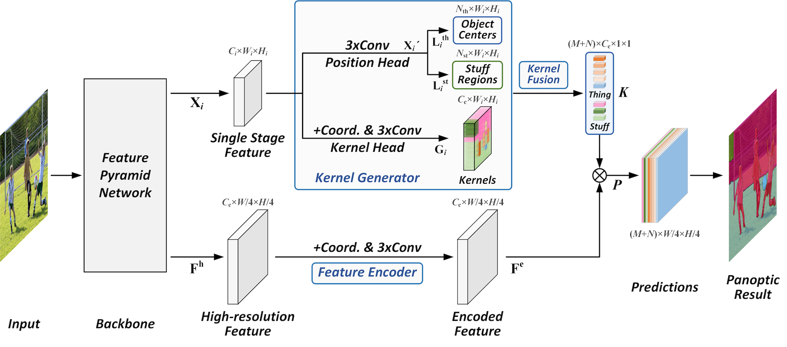

# PanopticFCN
## Training and evaluating on Cityscapes
In this repo, we apply Panoptic FCN to Cityscapes.

Doing:
- [x] Adding data pipeline for Cityscapes (adapted from original [Detectron2 code](https://github.com/facebookresearch/detectron2/tree/master/detectron2/data))
- [x] Adapting config to Cityscapes settings (config [here](configs/cityscapes/PanopticFCN-R50-cityscapes.yaml))
- [ ] Reproducing results from paper (training + evaluation)

To be done:
- [ ] Saving qualitative results
- [ ] Adding image summaries in Tensorboard

Current status:

<table><tbody>
<!-- START TABLE -->
<!-- TABLE HEADER -->
<th valign="bottom">Method</th>
<th valign="bottom">Backbone</th>
<th valign="bottom">LR</th>
<th valign="bottom">Batch size</th>
<th valign="bottom">Iters</th>
<th valign="bottom">PQ</th>
<th valign="bottom">PQ_th</th>
<th valign="bottom">PQ_st</th>
<th valign="bottom">config</th>
<th valign="bottom">download</th>
<!-- TABLE BODY -->
<tr>
<td align="left">PanopticFCN</td>
<td align="center">R50</td>
<td align="center">0.02</td>
<td align="center">32</td>
<td align="center">65k</td>
<td align="center">59.0</td>
<td align="center">51.3</td>
<td align="center">64.6</td>
<td align="center"><a href="configs/cityscapes/PanopticFCN-R50-cityscapes.yaml">config</a>
<td align="center">TBD</td>
</tr>
</tbody></table>


## Original 
**Fully Convolutional Networks for Panoptic Segmentation**

Yanwei Li, Hengshuang Zhao, Xiaojuan Qi, Liwei Wang, Zeming Li, Jian Sun, Jiaya Jia

[[`arXiv`](https://arxiv.org/pdf/2012.00720.pdf)] [[`BibTeX`](#CitingPanopticFCN)]

<div align="center">
  
</div><br/>


This project provides an implementation for the CVPR 2021 Oral paper "[Fully Convolutional Networks for Panoptic Segmentation](https://arxiv.org/pdf/2012.00720.pdf)" based on [Detectron2](https://github.com/facebookresearch/detectron2). Panoptic FCN is a conceptually simple, strong, and efficient framework for panoptic segmentation, which represents and predicts foreground things and background stuff in a unified fully convolutional pipeline.


## Installation
This project is based on [Detectron2](https://github.com/facebookresearch/detectron2), which can be constructed as follows.
* Install Detectron2 following [the instructions](https://detectron2.readthedocs.io/tutorials/install.html).
* Setup the dataset following [the structure](https://github.com/facebookresearch/detectron2/blob/master/datasets/README.md).
* Copy this project to `/path/to/detectron2/projects/PanopticFCN`

## Training
To train a model with 8 GPUs, run:
```bash
cd /path/to/detectron2
python3 projects/PanopticFCN/train.py --config-file <config.yaml> --num-gpus 8
```

For example, to launch PanopticFCN training on Cityscapes with ResNet-50 backbone on 4 GPUs,
one should execute:
```bash
cd /path/to/detectron2
python3 projects/PanopticFCN_cityscapes/train.py --config-file projects/PanopticFCN_cityscapes/configs/cityscapes/PanopticFCN-R50-cityscapes.yaml --num-gpus 4
```

## Evaluation
To evaluate a pre-trained model with 8 GPUs, run:
```bash
cd /path/to/detectron2
python3 projects/PanopticFCN/train.py --config-file <config.yaml> --num-gpus 8 --eval-only MODEL.WEIGHTS /path/to/model_checkpoint
```

## Results
Reproduced Cityscapes results will be presented below.

<table><tbody>
<!-- START TABLE -->
<!-- TABLE HEADER -->
<th valign="bottom">Method</th>
<th valign="bottom">Backbone</th>
<th valign="bottom">Sched</th>
<th valign="bottom">PQ</th>
<th valign="bottom">SQ</th>
<th valign="bottom">RQ</th>
<th valign="bottom">AP</th>
<th valign="bottom">mIoU</th>
<th valign="bottom">FPS</th>
<th valign="bottom">download</th>
<!-- TABLE BODY -->
<tr><td align="left">PanopticFCN</td>
<td align="center">R50</td>
<td align="center">1x</td>
<td align="center"> tbd </td>
<td align="center"> tbd </td>
<td align="center"> tbd </td>
<td align="center"> tbd </td>
<td align="center"> tbd </td>
<td align="center"> tbd </td>
<td align="center"> tbd </td>
</tr>
</tbody></table>

## <a name="CitingPanopticFCN"></a>Citing PanopticFCN

Consider cite PanopticFCN in your publications if it helps your research.

```
@inproceedings{li2021panopticfcn,
  title={Fully Convolutional Networks for Panoptic Segmentation},
  author={Yanwei Li, Hengshuang Zhao, Xiaojuan Qi, Liwei Wang, Zeming Li, Jian Sun, and Jiaya Jia},
  booktitle={IEEE Conference on Computer Vision and Pattern Recognition (CVPR)},
  year={2021}
}
```
Consider cite this project in your publications if it helps your research. 
```
@misc{PanopticFCN,
    author = {Yanwei Li},
    title = {PanopticFCN},
    howpublished = {\url{https://github.com/yanwei-li/PanopticFCN}},
    year ={2021}
}
```
